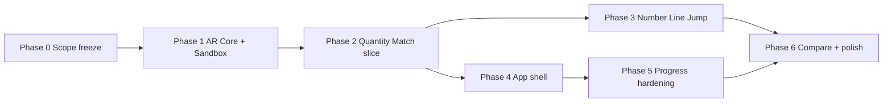

# AR Math Learning — System Review & Implementation Roadmap

**Document type:** Engineering review and execution plan  
**Last updated:** 2026-05-18  
**Companion reference:** `.agent/SYSTEM_STATUS.md` (file-level audit and navigation map)  
**Scope:** Local-first Unity AR client; backend explicitly deferred  
**Method:** Codebase inspection, README/ROLE_DOC alignment, cross-check with `SYSTEM_STATUS.md` (no device playtest)

---

## 1. Executive Summary

The project is **architecturally on track** for a local-first AR math learning app, but **product completion remains low**. The repository is best described as a **well-structured learning-layer prototype** on top of Unity’s Mobile AR Template—not a runnable child-facing application.

| Lens | Assessment |
|------|------------|
| **Architecture & pain-point coverage** | Sound: Presenter/View/Config separation, three activities aligned with quantity, comparison, and number-line skills |
| **Learning layer (C# logic)** | ~70% code-complete: framework + three activities compile; not integrated end-to-end |
| **Local-first AR MVP (product)** | **~20–25% complete** — includes AR, scenes, content, UI wiring, support-service integration, and shell flow |
| **Runnable demo today** | Template `SampleScene` only; product activities cannot run without AR implementations, scenes, and assets |

**Critical path:** Implement AR Core services → populate product scenes → author `SO_*` / `PFB_*` content → wire support services → deliver one vertical slice (Quantity Match) → expand.

**Do not treat** `LearningActivities_ImplementationSummary.md` or ROLE_DOC “complete” checklists as product-ready without verifying integration (see `SYSTEM_STATUS.md` §1).

---

## 2. How to Read This Document

| Section | Purpose |
|---------|---------|
| §3–4 | Current state and alignment with product intent |
| §5–7 | Architecture, weaknesses, technical debt, scalability |
| §8 | Subsystem status (Completed / Partial / Blocked / Future) |
| §9 | Critical blockers |
| §10 | **Implementation roadmap** (primary execution guide) |
| §11 | Priority matrix and defer list |
| §12 | Product-design layer mapping |
| §13 | Agent navigation index (paths per roadmap item) |

---

## 3. Completion Assessment

### 3.1 Layer vs product readiness

The **70% figure applies only to the learning C# layer** (presenters, views, configs-as-code, models). It does **not** include AR implementation, scenes, ScriptableObject assets, prefabs, app navigation, or support-service wiring.

| Area | State | Product readiness | Primary locations |
|------|--------|-------------------|-------------------|
| Learning logic | Partial–strong | Logic exists; not playable | `apps/unity-client/Assets/Core/Learning/`, `Assets/Features/Activities/*/Scripts/` |
| AR layer | Blocked | 0% — interfaces only | `Assets/Core/AR/` (empty), contracts in `Assets/Core/Learning/ActivityRunner/IAR*.cs` |
| Scene & app flow | Blocked | ~5% — empty `SC_*` files | `Assets/_Project/Scenes/`, `ProjectSettings/EditorBuildSettings.asset` |
| Content & config assets | Blocked | 0% — no `SO_*` / `PFB_*` in repo | `Features/Activities/*/ScriptableObjects/`, `Prefabs/`, `UI/` |
| Hint / feedback / progress | Partial | Services exist; **not called** from activities | `Assets/Core/Support/`, `Assets/Core/Data/LocalStorage/` |
| Local progress dashboard | Future | Storage only; no UI feature | `Assets/Features/Progress/` (empty) |
| App shell (menu, select) | Future | Placeholder scenes only | `Assets/Features/Home/`, `_Project/Scenes/SC_MainMenu.unity`, etc. |
| Backend sync | Out of scope | Skeleton only | `apps/backend/` |
| **End-to-end demo** | Blocked | Not achievable today | — |

### 3.2 Recommended readiness metric

For planning and reporting, use **local-first MVP readiness (~20–25%)** as the product metric until a single activity runs on device: AR spawn → input → check → hint → feedback → `SaveResult` → readable outcome.

---

## 4. Alignment With Product Intent

### 4.1 Agreed product track

```
Local-first AR app
  → help children understand number and quantity
  → develop order and spatial number sense
  → bridge AR objects, written numerals, symbols, and operations
  → stepwise hints, positive feedback, local progress
```

### 4.2 Activity ↔ pain-point mapping

| Activity | Pain point | Code status | Playable status |
|----------|------------|-------------|-----------------|
| **Quantity Match** | Link numerals to quantity; “how many?” | Presenter/View/Config implemented | **Blocked** — needs AR + assets + scene |
| **Compare Quantity** | More / fewer / equal; `>`, `<`, `=` | Implemented | **Blocked** — defer until vertical slice |
| **Number Line Jump** | Order, spatial number line, +/- via movement | Implemented | **Blocked** — highest AR demo value once core works |

**Verdict:** Correct at the **design and code-structure** level; **incorrect at the experience level** until AR Core, scenes, and content exist.

### 4.3 Architecture intent (must preserve)

```
Learning presenters  →  IAR* interfaces only  →  AR Core (AR Foundation + XRI)
Views                →  display + input events only (no correctness logic)
ActivityConfig (SO)  →  lesson content (not hardcoded in presenters)
```

Do **not** embed plane detection, placement, or low-level tap handling inside feature presenters (`ROLE_DOC.txt`, `README.md`).

---

## 5. Architectural Assessment

### 5.1 Strengths

1. **Clear layer boundaries (on paper):** Learning depends on `IARPlacementService`, `IARInteractionService`, `IARSessionService` rather than AR Foundation types in features.
2. **Consistent activity pattern:** Presenter → View → Config/Models across all three activities.
3. **Extensibility:** `ActivityPresenter` state machine and `ActivityConfig` base support additional activities without new scenes per lesson.
4. **Support services designed early:** Hint escalation, feedback queue, JSON local storage with session concept.
5. **Documented handoff:** `Assets/Docs/LearningActivities_ImplementationSummary.md` specifies AR/Audio/VFX contracts.

### 5.2 Weaknesses

| Weakness | Impact | Where it shows up |
|----------|--------|-------------------|
| **AR Core absent** | All activities fail at spawn/input | `Assets/Core/AR/**` (.gitkeep only) |
| **Integration gap** | Hints/feedback/progress never invoked in play | No `ProgressStorageProxy` / `FeedbackServiceProxy` usage in `Features/Activities/*/Scripts/*Presenter.cs` |
| **Dual hint paths** | Confusion, duplicate logic risk | `ActivityPresenter.RequestHint()` vs `Core/Support/HintSystem/HintSystem.cs` |
| **Empty product scenes** | False assumption that `SC_*` are configured | `Assets/_Project/Scenes/*.unity` (0-byte files) |
| **Build settings mismatch** | Play/Build runs template, not product | `EditorBuildSettings.asset` → `Assets/Scenes/SampleScene.unity` |
| **Views require serialized UI** | Null refs without prefabs/scenes | e.g. `QuantityMatchView.cs` SerializeField buttons/text |
| **Documentation overstates completion** | Mis-prioritization | `LearningActivities_ImplementationSummary.md`, ROLE_DOC §13 |
| **No assembly definitions** | Weaker compile-time layer enforcement | No `.asmdef` under `Assets/Core/` |
| **No automated tests** | Regressions in `CheckAnswer` undetected | `Core/*/Tests/`, `Features/Activities/*/Tests/` (.gitkeep only) |

### 5.3 Scalability and maintainability concerns

1. **JsonUtility persistence:** `ActivityResult` uses `DateTime`; `OverallStatistics` uses non-serialized `Dictionary` — data may not round-trip (`LocalProgressStorage.cs`, models in `Assets/Core/Learning/Models/`). Stabilize **before** building a progress dashboard on top.
2. **Prefab loading stub:** All activities’ `GetObjectPrefab()` return null — blocks real content pipeline until a registry or SO references exist.
3. **Template vs product asset noise:** Large `MobileARTemplateAssets/` and `Samples/XR Interaction Toolkit/` trees — agents should scope searches to `Core/`, `Features/`, `_Project/`.
4. **Feature `Scenes/` folders:** Present despite README discouraging them — risk of scene sprawl (`Features/Activities/*/Scenes/.gitkeep`).
5. **Missing `DataDefinitions/`:** README describes centralized SO definitions; folder does not exist — decide one authoring location before scaling content.

---

## 6. Technical Debt Register

| ID | Item | Severity | Stabilize before |
|----|------|----------|------------------|
| TD-01 | `ProgressStorageProxy.SaveResult` never called from presenters | High | Phase 2 exit (vertical slice) |
| TD-02 | `FeedbackServiceProxy` / audio-VFX stubs (log only) | Medium | Phase 2 (minimal AudioSource acceptable) |
| TD-03 | Duplicate hint systems | Medium | Phase 2 — pick single path |
| TD-04 | `JsonUtility` + `DateTime` / `Dictionary` | High | Phase 5 (before dashboard) |
| TD-05 | `GetObjectPrefab()` returns null | High | Phase 2 |
| TD-06 | Number Line Jump: instant move, no tile labels | Low | Phase 3 |
| TD-07 | No EditMode tests for answer checking | Medium | Phase 6 (quality gate) |
| TD-08 | `HintSystem.cs` contextual hints TODO (L216) | Low | Post-MVP |
| TD-09 | Empty `SC_*` committed as scenes | High | Phase 1 (replace with real scenes) |

---

## 7. Subsystem Status Matrix

Legend: **Complete** = meets ROLE_DOC for code in isolation | **Partial** = implemented but not integrated | **Blocked** = cannot proceed without dependency | **Future** = not started

| Subsystem | Status | Notes | Key paths |
|-----------|--------|-------|-----------|
| Activity framework | **Partial** | `ActivityPresenter` complete; no scene hookup | `Core/Learning/ActivityRunner/ActivityPresenter.cs` |
| Activity models | **Complete** | Result, answer, hint, state | `Core/Learning/Models/` |
| Quantity Match | **Partial** | Logic only | `Features/Activities/QuantityMatch/Scripts/` |
| Compare Quantity | **Partial** | Logic only | `Features/Activities/CompareQuantity/Scripts/` |
| Number Line Jump | **Partial** | Logic only | `Features/Activities/NumberLineJump/Scripts/` |
| AR session | **Blocked** | Interface only | `IARSessionService.cs` → implement `Core/AR/ARSession/` |
| AR placement | **Blocked** | Interface only | `IARPlacementService.cs` → `Core/AR/Placement/` |
| AR interaction | **Blocked** | Interface only | `IARInteractionService.cs` → `Core/AR/Interaction/` |
| AR group spawn helper | **Partial** | Depends on placement impl | `Core/Learning/Utils/ARGroupSpawnUtility.cs` |
| Hint system | **Partial** | Not used by features | `Core/Support/HintSystem/` |
| Feedback system | **Partial** | Events only, no playback | `Core/Support/FeedbackSystem/` |
| Local progress storage | **Partial** | Not saved from gameplay | `Core/Data/LocalStorage/` |
| Product scenes | **Blocked** | Empty files | `_Project/Scenes/SC_*.unity` |
| Scene navigation / boot | **Future** | No scripts | `_Project/Scripts/` (.gitkeep) |
| Home / activity select | **Future** | .gitkeep | `Features/Home/` |
| Progress dashboard | **Future** | .gitkeep | `Features/Progress/` |
| Parent mode | **Future** | .gitkeep | `Features/ParentMode/` |
| Shared prefabs & art | **Future** | Structure only | `Assets/Shared/` |
| ScriptableObject configs | **Blocked** | Menus exist, zero assets | `Create` → `AR Learning/*` in Editor |
| Editor test placeholders | **Partial** | Runtime primitives | `Features/Activities/Shared/ActivityPrefabSetup.cs` |
| Mobile AR template demo | **Complete** | Runnable separately | `Assets/Scenes/SampleScene.unity`, `MobileARTemplateAssets/` |
| Backend API | **Future** | Out of MVP scope | `apps/backend/` |

---

## 8. Critical Blockers

### 8.1 Blocker B1 — No AR Core implementation (P0)

Learning presenters inject `IARPlacementService` and `IARInteractionService` but **no class implements these interfaces** anywhere in the repository.

**Symptoms:** No spawn, no tap events, `placementService == null` errors, placeholder-only groups.

**Required deliverables:**

| Service | Target directory | Contract file |
|---------|------------------|---------------|
| `ARSessionService` | `Assets/Core/AR/ARSession/` | `IARSessionService.cs` |
| `ARPlacementService` | `Assets/Core/AR/Placement/` | `IARPlacementService.cs` |
| `ARInteractionService` | `Assets/Core/AR/Interaction/` | `IARInteractionService.cs` |

Reference: `Assets/Docs/LearningActivities_ImplementationSummary.md` §5 (handoff tables).

### 8.2 Blocker B2 — Product scenes are empty (P0)

All six `SC_*.unity` files under `Assets/_Project/Scenes/` are **zero-byte placeholders**. `EditorBuildSettings.asset` lists only `Assets/Scenes/SampleScene.unity`.

**Gate:** Do not wire activities until `SC_TestSandbox` or `SC_ARGameplay` contains a valid XR/AR rig.

### 8.3 Blocker B3 — No lesson content assets (P0)

No `SO_QuantityMatchConfig_*.asset`, no activity `PFB_*` prefabs, no UI panels. Presenters cannot display lessons or objects.

**Gate:** At least one `SO_*` and minimal `PFB_*` before declaring Phase 2 complete.

### 8.4 Blocker B4 — Support services not integrated (P1)

`HintSystem`, `FeedbackSystem`, and `LocalProgressStorage` are **orphaned** from the activity loop.

**Gate for vertical slice:** `SaveResult` on round/activity completion; feedback hooks on correct/incorrect; single hint path.

---

## 9. Implementation Roadmap

Roadmap principles:

1. **No new features** until one vertical slice is playable on device/simulator.
2. **Stabilize dependencies before dependents** (AR → scene → content → wire → shell → polish).
3. Each phase has **entry criteria**, **deliverables**, **acceptance criteria**, and **exit gate** before the next phase starts.
4. Backend, auth, AI tutor, and complex parent mode remain **out of scope**.

### Roadmap overview



| Phase | Name | Status today | Outcome |
|-------|------|--------------|---------|
| 0 | Scope freeze | **Complete** (documented) | Agreed MVP boundary |
| 1 | AR Core + test sandbox | **Blocked** | AR services proven in isolation |
| 2 | Quantity Match vertical slice | **Blocked** (depends on 1) | First playable lesson |
| 3 | Number Line Jump | **Future** | Flagship AR demo activity |
| 4 | Minimal app shell | **Future** | Boot → menu → select → play → progress |
| 5 | Progress schema & dashboard | **Future** | Trustworthy local analytics UI |
| 6 | Compare Quantity + polish | **Future** | Full MVP trio + UX/audio |

---

### Phase 0 — Scope freeze

**Status:** Complete (this document + README/ROLE_DOC)

**In scope for local-first MVP**

- Activities: Quantity Match (required), Number Line Jump (high priority), Compare Quantity (if capacity remains)
- Hint system, feedback system, local JSON progress, simple local dashboard
- Scenes: `SC_TestSandbox`, `SC_ARGameplay`, later full shell

**Explicitly deferred**

- `apps/backend/` API, auth, cloud sync
- AI tutor, voice, LLM
- Complex parent mode
- New activity types beyond the three above
- Large refactors of the learning layer

**Exit gate:** Team agrees not to expand scope until Phase 2 acceptance criteria pass.

---

### Phase 1 — AR Core and test sandbox

**Status:** Blocked (not started)  
**Depends on:** Phase 0  
**Blocks:** Phases 2–6

#### Deliverables

1. **`ARSessionService`** — wrap AR Foundation session; expose `IsSessionReady`, `IsTrackingStable`, `TrackingQuality`, events (`OnSessionReady`, `OnSessionLost`).
2. **`ARPlacementService`** — plane raycast / placement position; `SpawnAtPosition`, `SpawnGrid`, `SpawnCircle`, `ClearSpawnedObjects`, placement events.
3. **`ARInteractionService`** — register interactables; `OnObjectTapped`; highlight enable/disable.
4. **`SC_TestSandbox.unity`** — XR Origin, AR Session, session/placement/interaction service roots, debug UI optional.
5. **Optional:** `ARPlacementServiceMock.cs` (editor-only fixed position) for CI/editor without device — place under `Core/AR/Placement/` or `_Project/Tests/`.
6. **Editor build settings** — add `SC_TestSandbox` (may remain secondary to `SampleScene` until Phase 2).

#### Acceptance criteria

- [ ] On a physical device (iOS/Android): plane detection succeeds in `SC_TestSandbox`.
- [ ] Tap places a test prefab at hit position.
- [ ] `SpawnCircle` / `SpawnGrid` produce multiple objects; `ClearSpawnedObjects` removes them.
- [ ] Tapping a registered object fires `OnObjectTapped` with correct `GameObject`.
- [ ] Learning presenters are **unchanged**; validation is sandbox-only.

#### Exit gate (required before Phase 2)

> AR services pass sandbox acceptance on at least one target device. No activity math logic in AR classes.

#### Agent navigation — Phase 1

| Task | Inspect | Implement |
|------|---------|-------------|
| Session lifecycle | `IARSessionService.cs`, `MobileARTemplateAssets/Scripts/ARTemplateMenuManager.cs` (reference) | `Core/AR/ARSession/*.cs` |
| Placement / spawn | `IARPlacementService.cs`, XRI AR Starter sample | `Core/AR/Placement/*.cs` |
| Tap / highlight | `IARInteractionService.cs` | `Core/AR/Interaction/*.cs` |
| Sandbox scene | Empty `SC_TestSandbox.unity` | `_Project/Scenes/SC_TestSandbox.unity` |
| XR config | `Assets/XR/`, `ProjectSettings/EditorBuildSettings.asset` | Loader settings unchanged unless broken |

---

### Phase 2 — Quantity Match vertical slice

**Status:** Blocked (depends on Phase 1)  
**Priority:** **Highest product milestone**

This phase creates the **first true MVP**: one lesson running in AR with pedagogy loop intact.

#### Deliverables

| # | Deliverable | Path / reference |
|---|-------------|------------------|
| 1 | Easy config asset | `Features/Activities/QuantityMatch/ScriptableObjects/SO_QuantityMatchConfig_Easy.asset` |
| 2 | Object prefab(s) | `Shared/Art/Objects/` or `Features/.../Prefabs/PFB_Apple.prefab` |
| 3 | UI panel prefab | `Features/Activities/QuantityMatch/UI/PFB_QuantityMatchPanel.prefab` |
| 4 | Gameplay scene | `_Project/Scenes/SC_ARGameplay.unity` — XR rig, AR Session, EventSystem, Canvas, service roots, `QuantityMatchPresenter`, `QuantityMatchView` |
| 5 | Presenter wiring | Inject real `ARPlacementService`, `ARInteractionService` in scene or bootstrap |
| 6 | Prefab resolution | Implement `GetObjectPrefab()` or assign via config/SO — `QuantityMatchPresenter.cs` |
| 7 | Progress save | Call `ProgressStorageProxy.SaveResult` when round/activity completes — prefer hook in `ActivityPresenter.HandleCorrectAnswer` / `CompleteActivity` |
| 8 | Feedback | Call `FeedbackServiceProxy` on correct/incorrect (minimal `AudioSource` clips acceptable) |
| 9 | Hint path | Consolidate to one mechanism (recommend: keep `ActivityPresenter.RequestHint` + config hints for MVP; wire `HintService` later or merge in Phase 5) |
| 10 | Build settings | Register `SC_ARGameplay` for device builds when ready |

#### Acceptance criteria

- [ ] Child sees target numeral on UI.
- [ ] App spawns AR object groups on a detected plane.
- [ ] Child selects a group (tap or UI); app judges correct/incorrect.
- [ ] Wrong answer shows escalating hint (config-driven).
- [ ] Correct/incorrect triggers feedback (audio or clear UI — not log-only).
- [ ] `ActivityResult` persisted under `Application.persistentDataPath` / `learning_progress.json`.
- [ ] Activity cleans up spawned objects on exit (`Cleanup`, `ClearSpawnedObjects`).

#### Exit gate (required before Phase 3 or 4)

> Quantity Match completes at least one full round on device with save + feedback verified by reading JSON or proxy logs.

#### Agent navigation — Phase 2

| Task | Inspect | Modify |
|------|---------|--------|
| Lesson logic | `QuantityMatchPresenter.cs`, `QuantityMatchConfig.cs`, `QuantityMatchQuestion.cs` | Wiring only; avoid logic rewrites |
| UI | `QuantityMatchView.cs`, `IQuantityMatchView.cs` | Assign prefab references |
| Placeholder helper | `Features/Activities/Shared/ActivityPrefabSetup.cs` | Dev-only fallback |
| Setup guide | `Features/Activities/Shared/README_SCENE_SETUP.md` | Follow production setup section |
| Progress | `ProgressStorageProxy.cs`, `LocalProgressStorage.cs` | Call sites in presenter base or subclass |
| Feedback | `FeedbackServiceProxy.cs`, `FeedbackSystem.cs` | Implement `HandleSoundRequested` minimally |

---

### Phase 3 — Number Line Jump

**Status:** Future  
**Depends on:** Phase 2 exit gate (shared AR services and scene pattern proven)

**Rationale:** Strongest AR demonstration for stakeholders (spatial number line, movement, equation reveal). Code already exists; integration reuses Phase 1–2 infrastructure.

#### Deliverables

- `SO_NumberLineJumpConfig_Easy.asset` — `Features/Activities/NumberLineJump/ScriptableObjects/`
- `PFB_NumberTile.prefab`, `PFB_JumpCharacter.prefab` — feature `Prefabs/`
- Wire `NumberLineJumpPresenter` / `NumberLineJumpView` in `SC_ARGameplay` (swap active activity root)
- Tile number labels (TextMeshPro child on tile prefab)
- Error typing preserved in `NumberLineJumpAnswer` / `GetErrorType`

#### Acceptance criteria (example lesson)

- [ ] Character starts at **4**; child performs **3** jumps right; character stops at **7**.
- [ ] UI shows **4 + 3 = 7** (or config-equivalent equation string).
- [ ] Boundary bump feedback when jumping out of range (config + feedback hook).
- [ ] Result saved with appropriate `ErrorType` on failure.

#### Stabilization note

Movement is currently direct transform assignment (`NumberLineJumpPresenter.cs`) — acceptable for MVP; animation is polish (Phase 6).

#### Agent navigation — Phase 3

| File | Role |
|------|------|
| `NumberLineJumpPresenter.cs` | Spawn tiles, jump logic, answer check |
| `NumberLineJumpView.cs` | Equation UI, arrow buttons |
| `NumberLineJumpConfig.cs` | Rounds, hints, feedback strings |
| `JumpDirection.cs` | Direction enum |

---

### Phase 4 — Minimal app shell

**Status:** Future  
**Depends on:** Phase 2 exit gate (one playable activity); may proceed in parallel with Phase 3 if staffed separately

**Do not block Phase 2 on menus.** Phase 2 may launch `SC_ARGameplay` directly from Editor for demo.

#### Deliverables

| Scene | Purpose | Scripts (to create) |
|-------|---------|---------------------|
| `SC_Boot.unity` | Init proxies, AR loader, optional config load | `_Project/Scripts/BootLoader.cs` (suggested) |
| `SC_MainMenu.unity` | Start Learning, View Progress | `Features/Home/Scripts/` |
| `SC_ActivitySelect.unity` | Pick activity | Pass `activityId` + `SO` reference to gameplay |
| `SC_ARGameplay.unity` | Already from Phase 2 | Activity loader component |
| `SC_ProgressDashboard.unity` | Read statistics | `Features/Progress/Scripts/` |

#### Minimal UX

- **Main menu:** Start Learning · View Progress  
- **Activity select:** Quantity Match · Number Line Jump · Compare Quantity (disabled until ready)  
- **Progress:** Completed activities, accuracy, hints used (read from `LocalProgressStorage.GetActivityStatistics`)

#### Exit gate

> Cold start from `SC_Boot` → play Quantity Match → return to dashboard showing at least one saved result.

#### Agent navigation — Phase 4

| Area | Path |
|------|------|
| Scenes | `_Project/Scenes/SC_*.unity` |
| Navigation | `Core/UI/Navigation/` (currently empty — implement or use lightweight static loader) |
| Home feature | `Features/Home/` |
| Progress feature | `Features/Progress/` |

---

### Phase 5 — Progress hardening and dashboard

**Status:** Future  
**Depends on:** Phase 2 save path live; Phase 4 dashboard UI optional but recommended

#### Deliverables

1. Fix persistence schema (**TD-04**):
   - Replace `DateTime` with ISO 8601 `string` fields on `ActivityResult` (or use Newtonsoft if approved).
   - Replace runtime-only `Dictionary` stats with serializable `List` structures in `LocalProgressStorage.cs`.
2. Unify hint architecture (**TD-03**): either route `ActivityPresenter.RequestHint` through `HintSystem`, or document config-only path and remove duplicate.
3. Dashboard reads real data — `Features/Progress/Scripts/ProgressDashboardView.cs` (new).
4. Export/debug: `ProgressStorageProxy.ExportProgress()` for QA.

#### Exit gate

> Uninstall/reinstall or restart app — historical results still load correctly; dashboard numbers match raw JSON.

#### Agent navigation — Phase 5

| File | Role |
|------|------|
| `LocalProgressStorage.cs` | Schema, statistics |
| `ActivityResult.cs` | Field types |
| `ProgressStorageProxy.cs` | Singleton lifecycle |

---

### Phase 6 — Compare Quantity, polish, quality

**Status:** Future  
**Depends on:** Phases 2–3 patterns stable

#### Deliverables

- Compare Quantity integration (same pattern as Quantity Match) — `Features/Activities/CompareQuantity/`
- Audio/VFX: real clips in `Shared/Audio/`, particle prefabs in `Shared/Prefabs/Feedback/`
- EditMode tests for `CheckAnswer` in each activity — `Features/Activities/*/Tests/`
- Device matrix: ARCore + ARKit smoke tests
- Remove or document feature-level `Scenes/` folders per README convention

#### Exit gate

> All three activities playable from activity select; local-first MVP demo-ready.

---

## 10. Priority Matrix

| Priority | Work item | Stage | Blocked by | Paths |
|----------|-----------|-------|------------|-------|
| **P0** | Implement `ARSessionService` | Phase 1 | — | `Core/AR/ARSession/` |
| **P0** | Implement `ARPlacementService` | Phase 1 | — | `Core/AR/Placement/` |
| **P0** | Implement `ARInteractionService` | Phase 1 | — | `Core/AR/Interaction/` |
| **P0** | Build `SC_TestSandbox` | Phase 1 | — | `_Project/Scenes/SC_TestSandbox.unity` |
| **P0** | Author `SO_QuantityMatchConfig_Easy` | Phase 2 | Phase 1 | `Features/.../QuantityMatch/ScriptableObjects/` |
| **P1** | Build minimal `SC_ARGameplay` | Phase 2 | Phase 1 | `_Project/Scenes/SC_ARGameplay.unity` |
| **P1** | Create `PFB_*` object + UI panel | Phase 2 | — | `Features/.../Prefabs/`, `UI/` |
| **P1** | Wire Quantity Match E2E | Phase 2 | Phase 1 | `QuantityMatchPresenter.cs`, scene |
| **P1** | Wire `SaveResult` + feedback | Phase 2 | — | `ActivityPresenter.cs`, `ProgressStorageProxy.cs` |
| **P2** | Number Line Jump | Phase 3 | Phase 2 gate | `Features/.../NumberLineJump/` |
| **P2** | App shell scenes + navigation | Phase 4 | Phase 2 gate | `_Project/Scenes/`, `Features/Home/` |
| **P2** | Progress dashboard UI | Phase 4–5 | Save working | `Features/Progress/` |
| **P3** | Compare Quantity | Phase 6 | Phase 2 pattern | `Features/.../CompareQuantity/` |
| **P3** | Audio/VFX polish | Phase 6 | Core loop | `FeedbackServiceProxy.cs`, `Shared/Audio/` |
| **P3** | JsonUtility schema fix | Phase 5 | — | `ActivityResult.cs`, `LocalProgressStorage.cs` |

---

## 11. Explicitly Deferred (Do Not Start Yet)

| Item | Reason |
|------|--------|
| Backend API / sync | Out of local-first MVP; `apps/backend/` is empty |
| New activities beyond three | Integration debt unfinished |
| Large learning-layer refactor | Risk without tests; layer is usable |
| Complex parent mode | `Features/ParentMode/` empty; not on critical path |
| AI tutor / voice / LLM | Scope creep |
| Heavy analytics dashboard | Depends on TD-04 fix |
| Repurposing `SampleScene` as product entry | Use `_Project/Scenes/` instead |
| `docs/CONTRIBUTING.md` | Missing; low priority vs runnable app |

**Current failures are integration and infrastructure failures, not product-idea failures.**

---

## 12. Product Design Layer Mapping

| Design layer | Current state | Gap |
|--------------|---------------|-----|
| **Core learning engine** | Three activities + framework (Partial) | No E2E play |
| **Representation bridge** (object ↔ numeral ↔ symbol) | Modeled in configs/code (Partial) | No SO/assets/UI visible to child |
| **Integrated support** (hints, feedback) | Built (Partial) | Not wired to activity loop |
| **Emotional layer** (positive, low punishment) | Strings in config (Partial) | No audio/UX rhythm; retry exists in presenter |
| **Local-first progress** | Storage service (Partial) | No save calls; no dashboard |

**Summary:** Vision and skeleton match the agreed track; **the product experience does not yet exist**.

---

## 13. Agent Navigation Index

Quick lookup: **roadmap item → directories and files**.

### 13.1 By subsystem

| Subsystem | Status | Primary paths |
|-----------|--------|---------------|
| Learning framework | Partial | `apps/unity-client/Assets/Core/Learning/ActivityRunner/` |
| Learning models | Complete | `apps/unity-client/Assets/Core/Learning/Models/` |
| Quantity Match | Partial | `apps/unity-client/Assets/Features/Activities/QuantityMatch/Scripts/` |
| Compare Quantity | Partial | `apps/unity-client/Assets/Features/Activities/CompareQuantity/Scripts/` |
| Number Line Jump | Partial | `apps/unity-client/Assets/Features/Activities/NumberLineJump/Scripts/` |
| AR contracts | Blocked | `.../ActivityRunner/IARPlacementService.cs`, `IARInteractionService.cs`, `IARSessionService.cs` |
| AR implementation | Blocked | `apps/unity-client/Assets/Core/AR/` |
| Hints | Partial | `Assets/Core/Support/HintSystem/` |
| Feedback | Partial | `Assets/Core/Support/FeedbackSystem/` |
| Local storage | Partial | `Assets/Core/Data/LocalStorage/` |
| Product scenes | Blocked | `Assets/_Project/Scenes/` |
| Template AR demo | Complete | `Assets/Scenes/SampleScene.unity`, `Assets/MobileARTemplateAssets/` |
| Requirements / role | Reference | `/ROLE_DOC.txt`, `/README.md` |
| Learning handoff doc | Reference | `Assets/Docs/LearningActivities_ImplementationSummary.md` |
| Full file audit | Reference | `.agent/SYSTEM_STATUS.md` |

### 13.2 By roadmap phase

| Phase | Touch these paths |
|-------|-------------------|
| 1 | `Core/AR/**`, `_Project/Scenes/SC_TestSandbox.unity`, `ProjectSettings/EditorBuildSettings.asset`, `Assets/XR/**` |
| 2 | `Features/Activities/QuantityMatch/**`, `_Project/Scenes/SC_ARGameplay.unity`, `Core/Data/LocalStorage/`, `Core/Support/FeedbackSystem/`, `ActivityPresenter.cs` |
| 3 | `Features/Activities/NumberLineJump/**`, shared `SC_ARGameplay.unity` |
| 4 | `_Project/Scenes/SC_Boot.unity`, `SC_MainMenu.unity`, `SC_ActivitySelect.unity`, `SC_ProgressDashboard.unity`, `Features/Home/`, `Features/Progress/` |
| 5 | `LocalProgressStorage.cs`, `ActivityResult.cs`, `Features/Progress/` |
| 6 | `Features/Activities/CompareQuantity/**`, `Shared/Audio/`, `Shared/Prefabs/Feedback/` |

### 13.3 Debugging hotspots

| Symptom | Likely cause | First files to open |
|---------|--------------|---------------------|
| Nothing spawns | Null `IARPlacementService` or `GetObjectPrefab()` | `QuantityMatchPresenter.cs` (~L93–100, ~L228) |
| Tap ignored | `IARInteractionService` not registered | `*Presenter.cs` `RegisterInteractable` |
| No save file | `SaveResult` never called | `ActivityPresenter.cs`, `ProgressStorageProxy.cs` |
| Play opens wrong scene | Build settings | `ProjectSettings/EditorBuildSettings.asset` |
| “Complete” but broken | Doc drift | `LearningActivities_ImplementationSummary.md` vs this review |

---

## 14. Final Recommendation

1. **Freeze scope** (Phase 0 — done).  
2. **Implement AR Core and prove it in `SC_TestSandbox`** (Phase 1) — non-negotiable bottleneck.  
3. **Ship Quantity Match vertical slice in `SC_ARGameplay`** with save, feedback, and one `SO_*` config (Phase 2).  
4. **Add Number Line Jump** for demonstration depth (Phase 3).  
5. **Wrap with minimal shell and dashboard** (Phases 4–5).  
6. **Integrate Compare Quantity and polish** (Phase 6).

Until Phase 2 passes acceptance on device, treat all learning-layer “complete” claims as **code-complete only**, not **product-complete**.

---

## 15. Revision History

| Date | Author | Change |
|------|--------|--------|
| 2026-05-18 | System audit | Initial Vietnamese review |
| 2026-05-18 | Refactor | Full English rewrite; roadmap aligned to codebase; subsystem matrix; agent navigation index |

---

*For exhaustive file trees, interface method tables, and TODO inventories, see `.agent/SYSTEM_STATUS.md`.*
