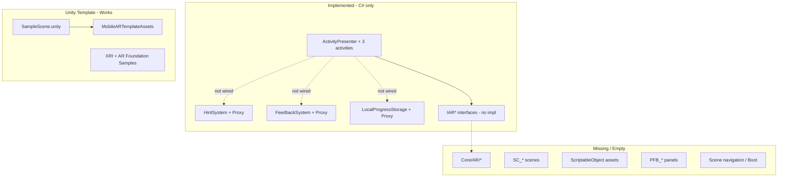

# AR Math Learning — System Status & Agent Navigation Map

**Generated:** 2026-05-18  
**Scope:** Full monorepo audit (Unity client primary; backend noted but out of local-first AR scope)  
**Audience:** Future agents, maintainers, onboarding  
**Method:** README + ROLE_DOC + codebase inspection (not runtime playtest)

---

## 1. Executive Summary

| Area | Status | One-line assessment |
|------|--------|---------------------|
| **Learning layer (C#)** | ~70% code-complete | Three activities + framework exist as compilable logic; not wired end-to-end |
| **AR Core (`Assets/Core/AR/`)** | 0% implemented | Only `.gitkeep` placeholders; interfaces defined in Learning layer |
| **Scenes & app flow** | ~5% | Six named scenes exist as **empty files**; build settings still point at template `SampleScene` |
| **Content assets** | ~0% | No `SO_*` configs, no `PFB_*` activity prefabs, no `DataDefinitions/` folder |
| **Support services integration** | ~30% | `HintSystem`, `FeedbackSystem`, `LocalProgressStorage` implemented but **not called** from activities |
| **Shell features (Home/Progress/Parent)** | 0% | `.gitkeep` only |
| **Backend** | 0% | Skeleton folders + empty `requirements.txt` |
| **Runnable local-first AR app** | **No** | Cannot ship a child-facing flow without AR implementations, scenes, assets, and wiring |

**Bottom line:** The repo is a **well-structured learning-layer prototype** on top of Unity’s **Mobile AR Template** (AR Foundation + XRI samples). It is **not** yet a usable local-first AR math app. The critical path is: implement AR services → build `SC_*` scenes → wire presenters to storage/feedback → create ScriptableObject content.

---

## 2. Engineering Mindset (Karpathy Guidelines)

Agents should internalize `karpathy-guidelines.mdc` when changing this repo:

1. **Think before coding** — AR interfaces are contracts with another layer; do not silently implement placement inside presenters.
2. **Simplicity first** — Do not add abstractions (repositories, evaluators folders) until a second consumer exists.
3. **Surgical changes** — Learning layer is marked “complete”; extend via interfaces and wiring, not drive-by refactors.
4. **Goal-driven execution** — Success = activity runs in `SC_ARGameplay` on device/simulator with tap → check → hint → save → visible feedback.

When ROLE_DOC and README conflict with code reality, **trust the code audit below** over `LearningActivities_ImplementationSummary.md` “Implementation Complete” status.

---

## 3. Intended System (from README)

### 3.1 Product goal

Monorepo for **AR math learning for children**:

- **Unity client** (`apps/unity-client`): AR lessons (quantity match, compare, number line jump), hints, feedback, local progress.
- **Backend** (`apps/backend`): Future API for progress sync (explicitly **out of scope** for current local-first milestone).
- **Docs** (`docs/`): LaTeX report; **no** `docs/CONTRIBUTING.md` despite README reference.

### 3.2 Target architecture (README)

```
Presenter (logic) → View (UI) → Model (ScriptableObject / data)
         ↓
   Core services (AR interfaces, Hint, Feedback, LocalStorage)
         ↓
   SC_ARGameplay (single shared AR gameplay scene; activities loaded by config)
```

### 3.3 Scene flow (planned)

| Scene | Path | Purpose |
|-------|------|---------|
| Boot | `Assets/_Project/Scenes/SC_Boot.unity` | Service init, config load |
| Main menu | `SC_MainMenu.unity` | Entry |
| Activity select | `SC_ActivitySelect.unity` | Pick lesson |
| AR gameplay | `SC_ARGameplay.unity` | **Shared** AR + dynamic activity |
| Progress | `SC_ProgressDashboard.unity` | Stats |
| Test sandbox | `SC_TestSandbox.unity` | AR/placement experiments |

### 3.4 Naming conventions

| Asset type | Pattern | Example |
|------------|---------|---------|
| Scene | `SC_[Name].unity` | `SC_ARGameplay.unity` |
| Prefab | `PFB_[Desc].prefab` | `PFB_Apple.prefab` |
| ScriptableObject | `SO_[Desc].asset` | `SO_QuantityMatchConfig_Easy.asset` |

---

## 4. Repository Map (Top Level)

```
BTL/
├── README.md                          # Architecture & conventions (Vietnamese)
├── ROLE_DOC.txt                       # Learning-layer role contract & DoD
├── .gitignore                         # Ignores .agent/, Unity Library/, backend venv
├── .agent/                            # Agent docs (this file) — NOT in git by default
├── apps/
│   ├── unity-client/                  # Unity 6000.0.71f1 project (primary)
│   └── backend/                       # Python skeleton only
├── docs/
│   └── report-latex/main.tex          # Academic report
└── scripts/                           # Empty (no automation yet)
```

**Unity project root:** `apps/unity-client/`  
**Custom product code (exclude Samples/MobileARTemplate when searching):** `Assets/Core/`, `Assets/Features/`, `Assets/_Project/`, `Assets/Shared/`, `Assets/Docs/`

---

## 5. Current vs Intended Architecture

### 5.1 Layer diagram (actual today)



### 5.2 Dependency direction (intended)

| Layer | Depends on | Must NOT depend on |
|-------|------------|-------------------|
| `Features/Activities/*` | `Core.Learning`, `Core.Data`, `Core.Support` (when wired) | AR Foundation internals, concrete placement |
| `Core/Learning` | `Core.Learning.Models`, AR **interfaces** only | `UnityEngine.XR.ARFoundation` in presenters |
| `Core/AR` (future) | AR Foundation, XRI | Activity-specific question logic |
| `Core/Support` | Learning models | Feature presenters |
| Views | Unity UI, presenter callbacks | Answer correctness logic |

---

## 6. Unity Client — Directory Index for Agents

### 6.1 `Assets/Core/` — Shared platform code

| Path | Status | Inspect when… |
|------|--------|---------------|
| `Core/AR/PlaneDetection/` | Empty (`.gitkeep`) | Implementing plane raycasts |
| `Core/AR/Placement/` | Empty | Implementing `IARPlacementService` |
| `Core/AR/Interaction/` | Empty | Implementing `IARInteractionService` |
| `Core/AR/ARSession/` | Empty | Implementing `IARSessionService` |
| `Core/Learning/Models/` | **Implemented** | Changing result/answer/hint schema |
| `Core/Learning/ActivityRunner/` | **Implemented** | Activity lifecycle, base presenter |
| `Core/Learning/Utils/ARGroupSpawnUtility.cs` | **Implemented** | Shared spawn layouts for Compare Quantity |
| `Core/Learning/Evaluators/` | Empty | Future extracted evaluators |
| `Core/Learning/Progress/` | Empty | Future progress UI helpers |
| `Core/Data/LocalStorage/` | **Implemented** | Persistence format, save/load bugs |
| `Core/Data/Repositories/` | Empty | Future backend sync |
| `Core/Data/DTOs/` | Empty | API mapping |
| `Core/Data/Migrations/` | Empty | Schema versioning |
| `Core/Support/HintSystem/` | **Implemented** | Hint escalation, cooldowns |
| `Core/Support/FeedbackSystem/` | **Implemented** | SFX/VFX hook points |
| `Core/Support/Tutorial/` | Empty | Onboarding tutorials |
| `Core/UI/BaseScreens/` | Empty | Shared screen base classes |
| `Core/UI/Widgets/` | Empty | Reusable UI widgets |
| `Core/UI/Navigation/` | Empty | Scene flow controller |
| `Core/Utils/*` | Empty | Constants, extensions |

### 6.2 `Assets/Features/` — Product features

| Path | Status | Inspect when… |
|------|--------|---------------|
| `Features/Activities/QuantityMatch/Scripts/` | **6 C# files** | Quantity match logic/UI |
| `Features/Activities/CompareQuantity/Scripts/` | **7 C# files** | Comparison activity |
| `Features/Activities/NumberLineJump/Scripts/` | **8 C# files** | Number line activity |
| `Features/Activities/Shared/` | `ActivityPrefabSetup.cs`, scene setup doc | Test placeholders |
| `Features/Activities/*/Prefabs/` | Empty | Creating `PFB_*` |
| `Features/Activities/*/UI/` | Empty | Canvas panels |
| `Features/Activities/*/ScriptableObjects/` | Empty | Authoring `SO_*` configs |
| `Features/Activities/*/Scenes/` | `.gitkeep` only (anti-pattern per README) | Do not add scenes here |
| `Features/Home/` | Empty | Main menu feature |
| `Features/Progress/` | Empty | Dashboard feature |
| `Features/ParentMode/` | Empty | Parent gate/settings |

### 6.3 `Assets/_Project/` — Scenes & project-specific assets

| Path | Status |
|------|--------|
| `Scenes/SC_*.unity` (6 files) | **0-byte empty placeholders** |
| `Scripts/`, `Prefabs/`, `UI/`, etc. | `.gitkeep` only |

### 6.4 Other asset roots

| Path | Status | Notes |
|------|--------|-------|
| `Assets/DataDefinitions/` | **Does not exist** | README plans SO content here; configs currently live under feature `ScriptableObjects/` (empty) |
| `Assets/Shared/` | Structure only | Intended shared `PFB_*`, art, audio |
| `Assets/ThirdParty/` | Empty | Manual imports |
| `Assets/Docs/LearningActivities_ImplementationSummary.md` | **Authoritative for learning layer design** | Claims “complete”; see gaps |
| `Assets/MobileARTemplateAssets/` | **Template content** | Working AR demo patterns; not product scenes |
| `Assets/Samples/XR Interaction Toolkit/` | Package samples | Reference only; do not treat as product code |
| `Assets/Scenes/SampleScene.unity` | **Only scene in Editor Build Settings** | Default template entry point |

---

## 7. Critical Files Reference

### 7.1 Learning framework (extend here first)

| File | Role |
|------|------|
| `Core/Learning/ActivityRunner/ActivityPresenter.cs` | State machine: Ready → InProgress → Completed/Failed; rounds; hints |
| `Core/Learning/ActivityRunner/ActivityConfig.cs` | Base `ScriptableObject`; menu `AR Learning/Activity Config` |
| `Core/Learning/ActivityRunner/ActivityView.cs` | `IActivityView`, `IActivityPresenter` contracts |
| `Core/Learning/ActivityRunner/IActivityRunner.cs` | Runner lifecycle interface |
| `Core/Learning/Models/ActivityState.cs` | State enum |
| `Core/Learning/Models/ActivityResult.cs` | Persisted result shape |
| `Core/Learning/Models/ActivityAnswer.cs` | Base answer + `ErrorType` |
| `Core/Learning/Models/ActivityHint.cs` | Hint levels |

### 7.2 AR contracts (implement in `Core/AR/`)

| File | Role |
|------|------|
| `Core/Learning/ActivityRunner/IARPlacementService.cs` | Spawn grid/circle, placement events |
| `Core/Learning/ActivityRunner/IARInteractionService.cs` | Tap/select/drag, register interactables |
| `Core/Learning/ActivityRunner/IARSessionService.cs` | Session ready, tracking quality |

**No classes implement these interfaces anywhere in the repo.**

### 7.3 Support services

| File | Role |
|------|------|
| `Core/Support/HintSystem/HintSystem.cs` | Escalation, cooldown, usage map |
| `Core/Support/HintSystem/HintServiceProxy.cs` | MonoBehaviour singleton accessor |
| `Core/Support/FeedbackSystem/FeedbackSystem.cs` | Queued feedback; fires sound/VFX events |
| `Core/Support/FeedbackSystem/FeedbackServiceProxy.cs` | Logs sound/VFX names (no real playback) |
| `Core/Support/FeedbackSystem/FeedbackData.cs` | `SO_FeedbackConfig` menu |
| `Core/Data/LocalStorage/LocalProgressStorage.cs` | JSON to `Application.persistentDataPath` |
| `Core/Data/LocalStorage/ProgressStorageProxy.cs` | DontDestroyOnLoad singleton |

### 7.4 Activities (feature entry points)

| Activity | Presenter | View | Config |
|----------|-----------|------|--------|
| Quantity Match | `Features/.../QuantityMatchPresenter.cs` | `QuantityMatchView.cs` | `QuantityMatchConfig.cs` |
| Compare Quantity | `CompareQuantityPresenter.cs` | `CompareQuantityView.cs` | `CompareQuantityConfig.cs` |
| Number Line Jump | `NumberLineJumpPresenter.cs` | `NumberLineJumpView.cs` | `NumberLineJumpConfig.cs` |

Shared test helper: `Features/Activities/Shared/ActivityPrefabSetup.cs` — runtime primitive placeholders.

Setup guide: `Features/Activities/Shared/README_SCENE_SETUP.md`

### 7.5 Documentation contracts

| File | Role |
|------|------|
| `ROLE_DOC.txt` | Learning team scope, DoD, what not to build |
| `README.md` | Monorepo structure, conventions |
| `Assets/Docs/LearningActivities_ImplementationSummary.md` | Handoff TODOs for AR/Audio/VFX teams |

---

## 8. Implemented Modules — Detail

### 8.1 Activity framework

**Location:** `Assets/Core/Learning/ActivityRunner/`

**Behavior:**

- `ActivityPresenter` manages rounds (`config.NumberOfRounds`), attempts (`MaxAttemptsPerQuestion`), hints (`MaxHintsPerQuestion`).
- Correct answer: `HandleCorrectAnswer` → `Invoke(StartNextRound, 2f)`.
- Wrong answer: retry until max attempts → `ActivityState.Failed`.
- Derived presenters override: `LoadRound`, `CheckAnswer`, `GetErrorType`, feedback/hint UI hooks.

**Gap:** Base presenter never calls `ProgressStorageProxy` or `FeedbackServiceProxy`.

### 8.2 Quantity Match

**Location:** `Assets/Features/Activities/QuantityMatch/Scripts/`

**Flow:**

1. `Initialize(config, view, placement, interaction)` wires dependencies.
2. `LoadRound` → `SpawnGroups` using `IARPlacementService.SpawnCircle` + `RegisterInteractable`.
3. Answer via UI `OnGroupSelected` or AR `OnObjectTapped` → `SubmitAnswer`.
4. `CheckAnswer` uses `QuantityMatchQuestion.IsCorrectAnswer`.

**Blockers:**

- `GetObjectPrefab()` returns `null` (TODO) → placeholder empty groups if placement service missing.
- Requires non-null `placementService` for spawn.

### 8.3 Compare Quantity

**Location:** `Assets/Features/Activities/CompareQuantity/Scripts/`

Uses `ARGroupSpawnUtility` for left/right groups. Comparison via `CompareQuantityAnswer` + config-driven feedback strings (`GetFeedbackString`, formatted hints).

### 8.4 Number Line Jump

**Location:** `Assets/Features/Activities/NumberLineJump/Scripts/`

- Spawns tiles + character via placement service.
- Jump direction enum: `JumpDirection.cs`.
- Tracks `JumpRecord` list and equation display in view.
- Movement is **instant position set** (no animation); boundary bump TODO.

### 8.5 Hint system

**Location:** `Assets/Core/Support/HintSystem/`

Fully implemented service with cooldowns and per-question keys.

**Integration gap:** Presenters use `ActivityPresenter.RequestHint()` reading hints from `ActivityConfig`, **not** `HintSystem.RequestHint()`. `HintServiceProxy` is unused by features.

**TODO in code:** `HintSystem.cs:216` — contextual hint by error type not implemented.

### 8.6 Feedback system

**Location:** `Assets/Core/Support/FeedbackSystem/`

Triggers sound/VFX **by string name** (`SFX_Correct`, `VFX_CorrectConfetti`, etc.) via events; proxies only `Debug.Log`.

**Integration gap:** Presenters call `view.ShowCorrectFeedback(string)` only — no `FeedbackServiceProxy.Instance`.

### 8.7 Local progress storage

**Location:** `Assets/Core/Data/LocalStorage/`

**Files:**

- `learning_progress.json` — all `ActivityResult` records
- `session_data.json` — current session metadata

**Path:** `Application.persistentDataPath` (platform-specific).

**Integration gap:** No presenter or `ActivityPresenter` calls `ProgressStorageProxy.SaveResult()` on round/activity completion.

**Technical debt:**

- `ActivityResult` uses `DateTime` fields — `JsonUtility` does not serialize `DateTime` reliably (may default on load).
- `OverallStatistics.ActivityStatistics` is `[NonSerialized]` — won't round-trip in JSON export.

---

## 9. Data Flow

### 9.1 Intended runtime data flow (not fully connected)

```
[SO_ActivityConfig asset]
        ↓ serialized questions/hints/feedback strings
[Activity Presenter.Initialize]
        ↓
[LoadRound] → IARPlacementService → AR objects in scene
        ↓
[User input] ← IARInteractionService / View events
        ↓
[SubmitAnswer] → CheckAnswer → View feedback strings
        ↓ (missing)
[ProgressStorageProxy.SaveResult(ActivityResult)]
        ↓ (missing)
[FeedbackServiceProxy → Audio/VFX]
```

### 9.2 Config authoring flow (not started)

```
Unity Editor → Create → AR Learning → [Activity] Config
        ↓ fill questions in inspector
Save as SO_* under Features/.../ScriptableObjects/ or DataDefinitions/
        ↓
Assign to Presenter serialized field in SC_ARGameplay
```

**No `.asset` config files exist in repo today.**

### 9.3 Answer/result models

| Type | File | Notes |
|------|------|-------|
| `QuantityMatchAnswer` | `QuantityMatchAnswer.cs` | Group index + counts |
| `CompareQuantityAnswer` | `CompareQuantityAnswer.cs` | Comparison enum |
| `NumberLineJumpAnswer` | `NumberLineJumpAnswer.cs` | Jump history, final position |
| `ActivityResult` | `ActivityResult.cs` | Shared persistence unit |

---

## 10. Execution Flow & Entry Points

### 10.1 What actually runs today

| Entry | Path | What happens |
|-------|------|--------------|
| **Editor Play (default)** | `Assets/Scenes/SampleScene.unity` | Mobile AR Template demo (plane scan, spawn primitives) — **not** product activities |
| **Product scenes** | `Assets/_Project/Scenes/SC_*.unity` | **Empty files — will not load meaningful content** |
| **ARDemoScene** | `Assets/Samples/.../ARDemoScene.unity` | XRI AR sample (reference) |

`ProjectSettings/EditorBuildSettings.asset` lists **only** `SampleScene.unity`.

### 10.2 Intended boot flow (to implement)

```
SC_Boot
  → init ProgressStorageProxy, FeedbackServiceProxy, HintServiceProxy
  → init AR session services
  → load ScriptableObject registry / addressables
SC_MainMenu
SC_ActivitySelect → passes activityId + SO config reference
SC_ARGameplay
  → enable one activity root (QuantityMatch | Compare | NumberLine)
  → wait IARSessionService.IsSessionReady
  → presenter.StartActivity()
SC_ProgressDashboard (read LocalProgressStorage statistics)
```

**Missing:** Any `SceneLoader`, `GameBootstrap`, or menu scripts in `_Project/Scripts/`.

### 10.3 In-scene test flow (documented, not set up)

See `Features/Activities/Shared/README_SCENE_SETUP.md`:

1. Add `ActivityPrefabSetup` to `SC_ARGameplay`.
2. Add presenter + view components per activity.
3. Inject mock AR services for editor mouse testing.

---

## 11. Dependencies

### 11.1 Unity packages (`Packages/manifest.json`)

| Package | Version | Role |
|---------|---------|------|
| `com.unity.xr.arfoundation` | 6.3.1 | AR session, planes |
| `com.unity.xr.arcore` / `arkit` | 6.3.1 | Platform providers |
| `com.unity.xr.interaction.toolkit` | 3.3.0 | Interactors, AR starter assets |
| `com.unity.xr.management` | 4.5.4 | XR loaders |
| `com.unity.render-pipelines.universal` | 17.0.4 | URP |
| `com.unity.inputsystem` | 1.19.0 | Input |

**Editor version:** Unity `6000.0.71f1` (`ProjectSettings/ProjectVersion.txt`)

### 11.2 External / template assets

- **Mobile AR Template** (`MobileARTemplateAssets/`) — UI prompts, menu manager (`ARTemplateMenuManager.cs`), plane visualizer fader.
- **XRI Samples** — large volume; exclude from product searches.

### 11.3 Backend (deferred)

`apps/backend/requirements.txt` is a comment placeholder. Structure:

```
apps/backend/app/{api,core,models,services,repositories}/
```

No Python source files beyond `.gitkeep`.

---

## 12. Unresolved TODOs (Codebase Inventory)

### 12.1 AR team (blocking)

| Location | Description |
|----------|-------------|
| `IARPlacementService.cs` | Full interface implementation in `Core/AR/Placement/` |
| `IARInteractionService.cs` | Tap/highlight in `Core/AR/Interaction/` |
| `IARSessionService.cs` | Session lifecycle in `Core/AR/ARSession/` |
| `ARGroupSpawnUtility.cs:51` | Optional `SpawnGrid` on placement service |

### 12.2 Learning / integration

| Location | Description |
|----------|-------------|
| All `*Presenter.cs` `GetObjectPrefab()` | Returns null; needs prefab registry or SO references |
| Presenters | Wire `ProgressStorageProxy.SaveResult` on `CompleteActivity` / round end |
| Presenters / `ActivityPresenter` | Call `FeedbackServiceProxy` on correct/incorrect/complete |
| Optional | Use `HintSystem` instead of duplicating hint logic in base presenter |
| `QuantityMatchPresenter.cs:98` | Show AR error in UI when placement null |
| `QuantityMatchView.cs` | Highlight groups, AR interaction notify, finish navigation |
| `NumberLineJumpPresenter.cs` | Tile numbers, bump animation, smooth AR movement |

### 12.3 Audio / VFX

| Location | Description |
|----------|-------------|
| `FeedbackServiceProxy.cs` | Implement actual clip/particle playback |
| `FeedbackSystem.cs` | Remove log-only stubs |

### 12.4 Content / scenes

| Item | Description |
|------|-------------|
| All `SC_*.unity` | Build real scenes with AR rig, canvas, service roots |
| Editor build settings | Register `SC_Boot` → … → gameplay order |
| `PFB_*` prefabs | Apple, carrot, tiles, UI panels per Implementation Summary §5 |
| `SO_*` assets | Per-activity configs with question data |

---

## 13. Partially Implemented Features

| Feature | Code | Assets | Scene wiring | Runnable |
|---------|------|--------|--------------|----------|
| Activity framework | Yes | No SO | No | No |
| Quantity Match | Yes | No | No | No |
| Compare Quantity | Yes | No | No | No |
| Number Line Jump | Yes | No | No | No |
| Hint escalation service | Yes | — | Not wired | No |
| Feedback SFX/VFX hooks | Stubs | No audio | Not wired | No |
| Local JSON progress | Yes | — | Not wired | No |
| AR placement/interaction | Interfaces only | — | — | No |
| Main menu / select / progress UI | — | — | Empty scenes | No |
| Parent mode | — | — | — | No |
| Editor AR template demo | Template | Yes | SampleScene | **Yes** (demo only) |

---

## 14. Technical Debt & Unstable Areas

1. **Documentation vs reality:** `LearningActivities_ImplementationSummary.md` and ROLE_DOC checklist claim learning layer “complete”; end-to-end usability is not achieved.
2. **Empty product scenes:** Risk of agents assuming scenes are configured.
3. **No assembly definitions:** All custom scripts in default assembly — may slow compile as project grows; no enforced layer boundaries.
4. **JsonUtility limitations:** `DateTime`, `Dictionary` in statistics — persistence may silently corrupt or omit fields.
5. **Dual hint paths:** `ActivityPresenter.RequestHint` vs `HintSystem` — consolidate to one.
6. **Views require serialized UI:** Without prefabs/scenes, all `SerializeField` UI refs are null — buttons/text won't appear.
7. **Feature `Scenes/` folders:** Exist despite README saying not to use — remove or keep empty to avoid confusion.
8. **`.agent/` gitignored:** This report won't be committed unless `.gitignore` changes — intentional for local agent use.

### Debugging hotspots

| Symptom | Likely cause | Inspect |
|---------|--------------|---------|
| Nothing spawns in activity | `placementService == null` or `GetObjectPrefab() == null` | Presenter `SpawnGroups`, AR mock |
| Taps ignored | `interactionService` null or not registered | `RegisterInteractable`, mock collider |
| No save file | `SaveResult` never called | Wire in `HandleCorrectAnswer` / `CompleteActivity` |
| Play opens wrong scene | Build settings | `EditorBuildSettings.asset` |
| AR works in template but not product | Using SampleScene vs empty `SC_*` | Scene choice |
| Compile errors after moving scripts | Namespace `Core.*`, `Features.*` | `.cs` namespaces match folder intent |

---

## 15. Backend Status (Reference Only)

Per user scope: **ignore for local-first AR milestone.**

- `apps/backend/`: folder skeleton, `.env.example` with comments only.
- No FastAPI/Flask app, models, or tests.
- README references future sync; no client code calls remote APIs.

---

## 16. Gap Analysis — Local-First AR System

### 16.1 What the system cannot do today

- Launch a guided child flow (boot → menu → pick lesson → play → see progress).
- Run any product activity in-editor or on device with real AR placement.
- Show authored lesson content (numbers, groups, number lines) from assets.
- Play sounds or particles on correct/incorrect (only logs).
- Persist learning results after play (storage exists but uncalled).
- Display progress dashboard from saved data.
- Parent mode, tutorials, or skill-based leveling (`DataDefinitions/` absent).

### 16.2 What blocks completion (ordered)

| Priority | Blocker | Owner layer | Files to create/modify |
|----------|---------|-------------|------------------------|
| P0 | No `IAR*` implementations | AR Core | `Core/AR/**/*.cs` |
| P0 | Empty `SC_*` scenes + wrong build scene | App shell | `_Project/Scenes/*`, `EditorBuildSettings.asset` |
| P0 | No activity ScriptableObjects | Content | `Features/*/ScriptableObjects/SO_*.asset` |
| P1 | Presenter ↔ storage not wired | Learning | `ActivityPresenter.cs` or each presenter |
| P1 | Presenter ↔ feedback not wired | Learning | Presenters + `FeedbackServiceProxy` |
| P1 | Prefabs + UI panels | Art/UI | `Features/*/Prefabs`, `UI/`, `Shared/` |
| P2 | Scene navigation / bootstrap | App shell | `_Project/Scripts/` |
| P2 | Progress dashboard feature | Features/Progress | New scripts + `SC_ProgressDashboard` |
| P2 | Mock AR for editor testing | AR Core | Optional `ARPlacementServiceMock.cs` |
| P3 | Home / activity select | Features/Home | UI + scene wiring |
| P3 | JsonUtility schema fixes | Data | `ActivityResult`, `OverallStatistics` |

### 16.3 Recommended implementation sequence (local-first AR)

**Phase A — Make AR layer real (unblocks all activities)**

1. Implement `ARSessionService` wrapping AR Foundation session state.
2. Implement `ARPlacementService` (plane raycast, `SpawnGrid`/`SpawnCircle`, clear).
3. Implement `ARInteractionService` (tap via XRI or `ARRaycast` + colliders).
4. Add `SC_TestSandbox.unity` content to validate spawn/tap independent of lessons.

**Phase B — Minimal playable loop**

1. Populate `SC_ARGameplay.unity`: XR Origin, AR Session, EventSystem, Canvas, service roots, one activity root.
2. Create `SO_QuantityMatchConfig_Easy` with 2–3 questions.
3. Wire `QuantityMatchPresenter` + mock or real AR services.
4. Call `ProgressStorageProxy.SaveResult` when round completes.
5. Hook `FeedbackServiceProxy` (even placeholder AudioSource clips).

**Phase C — Content & polish**

1. Remaining activities + configs.
2. `SC_Boot`, `SC_MainMenu`, `SC_ActivitySelect` with simple navigation script.
3. `SC_ProgressDashboard` reading `GetActivityStatistics`.
4. Replace primitive placeholders with `PFB_Apple`, etc.

**Phase D — Quality**

1. Unit tests for `CheckAnswer` logic (EditMode, no AR).
2. Fix JSON persistence types.
3. Device testing ARCore/ARKit.

---

## 17. Agent Quick-Start Checklists

### 17.1 “Add a new activity”

1. Copy structure from `Features/Activities/QuantityMatch/`.
2. Extend `ActivityConfig` → new `SO_*` menu item.
3. Subclass `ActivityPresenter` + `MonoBehaviour` view + question/answer types.
4. Register in activity select (once built).
5. Do **not** add `Scenes/` under feature.

### 17.2 “Fix AR spawning”

1. Read `IARPlacementService.cs` contract.
2. Inspect `QuantityMatchPresenter.SpawnGroups` (line ~93+).
3. Implement service under `Core/AR/Placement/`.
4. Test in `SC_TestSandbox` before gameplay scene.

### 17.3 “Fix progress not saving”

1. `Core/Data/LocalStorage/LocalProgressStorage.cs`
2. `ProgressStorageProxy.SaveResult`
3. Add call in `ActivityPresenter.HandleCorrectAnswer` / `CompleteActivity` when `currentResult` finalized

### 17.4 “UI not showing”

1. Open scene (likely empty — must build UI first).
2. `QuantityMatchView.cs` — needs Text/Button references assigned.
3. Create `PFB_QuantityMatchPanel` per `README_SCENE_SETUP.md`

---

## 18. File Count Summary (Custom Code)

| Category | `.cs` files (approx.) | Notes |
|----------|----------------------|-------|
| Core (product) | 20 | Excludes `.gitkeep` |
| Features (product) | 21 | 3 activities + shared |
| Mobile template + Samples | 27+ | Third-party/template |
| Unit tests | 0 | `Tests/` folders are `.gitkeep` only |

---

## 19. Related Documents

| Document | Path |
|----------|------|
| Monorepo README | `/README.md` |
| Learning role & DoD | `/ROLE_DOC.txt` |
| Learning implementation detail | `apps/unity-client/Assets/Docs/LearningActivities_ImplementationSummary.md` |
| Scene wiring guide | `apps/unity-client/Assets/Features/Activities/Shared/README_SCENE_SETUP.md` |
| Karpathy agent guidelines | External: `d:\Hackathon\andrej-karpathy-skills\.cursor\rules\karpathy-guidelines.mdc` |

---

## 20. Revision Log

| Date | Change |
|------|--------|
| 2026-05-18 | Initial comprehensive audit |

---

*End of SYSTEM_STATUS.md*
