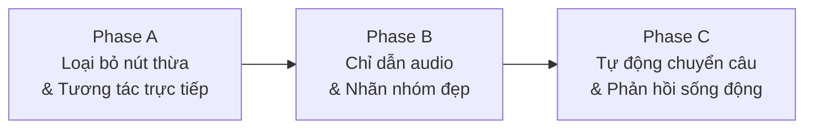

# Kế Hoạch Cải Thiện UX/UI Quantity Match — Tối Ưu Cho Trẻ 4-6 Tuổi

**Đối tượng:** Trẻ 4-6 tuổi gặp khó khăn trong học toán (dyscalculia).  
**Phạm vi:** Unity client tại `apps/unity-client`, tập trung cải thiện **trải nghiệm tương tác thực tế** — không thay đổi core learning logic.  
**Nền tảng:** Unity Editor (mock AR).

---

## Phân Tích Hiện Trạng — Các Vấn Đề UX Nghiêm Trọng Cần Giải Quyết

> [!CAUTION]
> **Giao diện hiện tại không phù hợp cho trẻ 4-6 tuổi.** Trẻ ở độ tuổi này **chưa biết đọc**, không hiểu tiếng Anh, và không có khả năng phân biệt nhiều nút bấm nhỏ cùng lúc. Giao diện hiện tại yêu cầu quá nhiều thao tác nhận thức phức tạp.

### Bảng phân tích chi tiết vấn đề hiện tại

| # | Vấn đề | Mức độ | Chi tiết |
|---|--------|--------|----------|
| 1 | **Quá nhiều nút bấm trên màn hình** | 🔴 Nghiêm trọng | Mỗi câu hỏi hiện có: 3 nút Group + 1 nút Hint + 1 nút Cancel = **5 nút cùng lúc**. Trẻ 4-6 tuổi bị quá tải lựa chọn (choice overload). |
| 2 | **Nút bấm quá nhỏ và sát nhau** | 🔴 Nghiêm trọng | Nút Group 1/2/3 chỉ `170×58px`, nút Hint/Cancel `170×58px` — quá nhỏ cho ngón tay trẻ nhỏ trên màn hình cảm ứng. Rất dễ bấm nhầm. |
| 3 | **Toàn bộ text bằng tiếng Anh** | 🔴 Nghiêm trọng | "Choose the group with exactly 2 animals", "Question 1 of 10", "Group 1", "Hint", "Cancel" — trẻ 4-6 tuổi Việt Nam không đọc được. |
| 4 | **Tương tác gián tiếp (indirect interaction)** | 🟡 Quan trọng | Trẻ phải **nhìn thú → đếm → ghi nhớ nhóm → tìm nút → bấm nút tương ứng** — quá nhiều bước nhận thức. Trẻ 4-6 tuổi nên **chạm trực tiếp vào nhóm thú** mà không cần qua trung gian nút bấm. |
| 5 | **Nhãn nhóm (Group Labels) xoay và trôi nổi** | 🟡 Quan trọng | Chữ "Group 1", "Group 2" hiện bằng `TextMesh` xoay ngẫu nhiên, font mặc định mảnh, dễ đè lên con vật hoặc biến mất khi camera xoay. |
| 6 | **Nền đen hoàn toàn** | 🟡 Quan trọng | Nền `#000000` tạo cảm giác u ám, không phù hợp cho ứng dụng giáo dục trẻ em. |
| 7 | **Không có audio hướng dẫn** | 🟡 Quan trọng | Trẻ 4-6 tuổi chưa biết đọc — cần **nghe** hướng dẫn bằng giọng nói thay vì đọc text. |
| 8 | **Nút Cancel hiện ngay trên gameplay** | 🟠 Vừa | Trẻ dễ bấm nhầm Cancel giữa chừng, mất tiến trình. Nút thoát nên được giấu đi hoặc yêu cầu xác nhận. |
| 9 | **Feedback text-only khi đúng/sai** | 🟠 Vừa | Trẻ 4-6 tuổi cần phản hồi đa giác quan: animation vui vẻ khi đúng, lắc nhẹ khi sai — không chỉ đổi màu text. |

---

## Nguyên Tắc Thiết Kế Cho Trẻ 4-6 Tuổi

> [!IMPORTANT]
> Triết lý cốt lõi: **"Càng ít nút bấm càng tốt — tương tác trực tiếp là ưu tiên số 1."**  
> Trẻ 4-6 tuổi chưa biết đọc, vận động tinh chưa phát triển hoàn thiện, và dễ bị phân tán. Mọi thiết kế phải tuân theo các nguyên tắc dưới đây.

| # | Nguyên tắc | Áp dụng cụ thể |
|---|-----------|-----------------|
| 1 | **Chạm trực tiếp (Direct Touch)** | Chạm vào nhóm thú = chọn nhóm. Không cần nút trung gian Group 1/2/3. |
| 2 | **Zero-text cho trẻ** | Thay mọi câu lệnh text bằng **audio** + **icon minh họa**. Text chỉ dành cho phụ huynh/giáo viên nhìn. |
| 3 | **Tối đa 1-2 nút trên màn hình** | Lúc gameplay: chỉ có 1 nút Gợi ý (icon bóng đèn, rất lớn). Nút thoát giấu vào góc nhỏ hoặc cử chỉ swipe. |
| 4 | **Vùng chạm cực lớn** | Tối thiểu `120×120px` cho mọi vùng tương tác. Nhóm thú sử dụng hitbox mở rộng toàn bộ khu vực nhóm. |
| 5 | **Phản hồi tức thì & đa giác quan** | Đúng → animation nhảy vui + confetti + âm thanh vỗ tay. Sai → lắc nhẹ + âm thanh "ùm" mềm + nhấp nháy viền cam. |
| 6 | **Tự động chuyển tiếp** | Sau khi trả lời đúng, tự động chuyển câu hỏi tiếp theo sau 2 giây kèm animation — không cần bấm nút "Next". |
| 7 | **Màu sắc ấm, sống động** | Nền pastel gradient thay cho đen. Nhóm thú có viền/hào quang màu sắc giúp phân biệt. |
| 8 | **Chỉ dẫn bằng âm thanh** | Đầu mỗi câu: phát audio "Chọn nhóm có 5 con vật nhé!" bằng tiếng Việt. |

---

## Proposed Changes

Kế hoạch được chia thành 3 Phase tập trung vào những thay đổi có tác động lớn nhất đến trải nghiệm trẻ:

---

### Phase A: Loại Bỏ Nút Thừa & Tương Tác Trực Tiếp Vào Nhóm Thú

> [!IMPORTANT]
> Đây là thay đổi quan trọng nhất. Sau Phase này, trẻ chỉ cần **chạm vào nhóm thú** để trả lời — không cần bấm nút "Group 1/2/3" nữa.

#### Mục tiêu
- Xóa hoàn toàn các nút "Group 1", "Group 2", "Group 3" khỏi UI runtime
- Xóa nút "Cancel" khỏi vùng gameplay chính (chuyển thành icon nhỏ ở góc trên)
- Giữ lại duy nhất 1 nút "Gợi ý" (icon bóng đèn) to hơn và đẹp hơn
- Bổ sung visual highlight khi chạm vào nhóm thú (viền sáng quanh nhóm)

#### Thay đổi chi tiết

##### [MODIFY] [QuantityMatchView.cs](file:///d:/.Kỳ%20II%20năm%20Ba/Chuyên%20đề/BTL/apps/unity-client/Assets/Features/Activities/QuantityMatch/Scripts/QuantityMatchView.cs)
Đây là file chứa toàn bộ runtime UI generation. Cần thay đổi lớn:

- **Xóa hoàn toàn `EnsureRuntimeGroupButtons()`** — không tạo nút Group 1/2/3 nữa
- **Xóa nút Cancel khỏi vùng action bar chính** — thay bằng icon nhỏ (`48×48px`) ở góc trên phải màn hình, với icon `✕` hoặc `🏠`
- **Phóng to nút Hint** — từ `170×58px` lên tối thiểu `140×140px`, chỉ dùng icon bóng đèn `💡` (không text)
- **Đổi toàn bộ text sang tiếng Việt:**
  - `"Choose the group with exactly {n} animals"` → `"Chọn nhóm có {n} con"` (giữ text ngắn nhất có thể, text này chỉ là hỗ trợ cho người lớn — trẻ sẽ nghe audio)
  - `"Question {n} of {m}"` → `"Câu {n}/{m}"`
  - `"How many animals are on the plane?"` → `"Có bao nhiêu con vật?"`
  - Các feedback message: tiếng Việt
- **Tăng kích thước target number display** — số mục tiêu (ví dụ: "5") nên font `96pt`, bôi đậm, có nền bo tròn contrast cao, pulse animation nhẹ khi round mới bắt đầu
- **Bỏ `SetRuntimeGroupButtonsActive()`, `SetRuntimeGroupButtonsInteractable()`** — vì không còn group buttons
- **Ẩn number input panel khi `!currentUsesNumberInputMode`** — giữ nguyên số input logic cho round 6-10 nhưng tăng kích thước digit buttons lên `120×80px`

##### [MODIFY] [QuantityMatchPresenter.cs](file:///d:/.Kỳ%20II%20năm%20Ba/Chuyên%20đề/BTL/apps/unity-client/Assets/Features/Activities/QuantityMatch/Scripts/QuantityMatchPresenter.cs)
- **Mở rộng hitbox nhóm thú** (`GroupHitboxPadding`) — tăng từ `0.44f` lên `0.7f` để vùng chạm lớn hơn, trẻ dễ chạm trúng hơn
- **Thêm visual highlight khi chạm vào nhóm:**
  - Khi `HandleObjectTapped()` được gọi, trước khi submit answer: tạo hiệu ứng viền sáng (outline glow) quanh nhóm được chọn trong `0.3s`
  - Nếu đúng: giữ viền xanh lá + trigger confetti
  - Nếu sai: viền cam nhấp nháy 2 lần rồi tắt
- **Đổi nhãn nhóm (Group Label) sang tiếng Việt** — `$"Nhóm {groupIndex + 1}"` thay vì `$"Group {groupIndex + 1}"`

##### [MODIFY] [QuantityMatchRuntimeUI.cs](file:///d:/.Kỳ%20II%20năm%20Ba/Chuyên%20đề/BTL/apps/unity-client/Assets/Features/Activities/QuantityMatch/Scripts/QuantityMatchRuntimeUI.cs)
- Cập nhật `CreateCanvas()`: đổi `referenceResolution` từ `1920×1080` sang `1080×1920` (portrait-first cho tablet/phone trẻ em)

---

### Phase B: Nhãn Nhóm Trực Quan & Nền Thân Thiện

#### Mục tiêu
- Thay thế nhãn TextMesh xấu bằng nhãn 3D billboard đẹp mắt
- Thêm viền/halo màu sắc xung quanh mỗi nhóm thú giúp trẻ phân biệt nhóm
- Thay nền đen bằng gradient pastel

#### Thay đổi chi tiết

##### [MODIFY] [QuantityMatchPresenter.cs](file:///d:/.Kỳ%20II%20năm%20Ba/Chuyên%20đề/BTL/apps/unity-client/Assets/Features/Activities/QuantityMatch/Scripts/QuantityMatchPresenter.cs) — `AddGroupLabel()`
Viết lại hoàn toàn hàm `AddGroupLabel()`:

- **Tạo tấm biển nhãn hình bo tròn (Pill-shaped label)** thay vì TextMesh đơn giản:
  - Nền: Sprite hình bo tròn (rounded rectangle), bán trong suốt, màu sắc riêng cho từng nhóm: Nhóm 1 = xanh dương pastel, Nhóm 2 = cam pastel, Nhóm 3 = xanh lá pastel
  - Text: `"1"`, `"2"`, `"3"` (chỉ số — không cần chữ "Nhóm") font lớn (`0.02f characterSize`), đậm, trắng
  - Luôn quay mặt về camera (Billboard behavior) nhưng giữ trục đứng
  - Vị trí: phía trên nhóm thú `0.65f` thay vì phía trước

##### [NEW] `Assets/Features/Activities/Shared/Scripts/GroupAreaIndicator.cs`
Component mới để tạo vùng chỉ thị nhóm trên mặt đất:

- Vẽ một vòng tròn hoặc hình elip mỏng (decal) trên mặt đất xung quanh mỗi nhóm thú
- Màu sắc tương ứng với nhãn nhóm (xanh, cam, xanh lá) — viền mềm, bán trong suốt
- Animated: viền nhấp nháy nhẹ khi đến lượt trả lời (pulse `0.8→1.0` opacity)
- Khi trẻ chạm vào nhóm: viền sáng lên rõ ràng (`1.0` opacity, scale nhẹ `1.05→1.0`)

##### [MODIFY] [QuantityMatchView.cs](file:///d:/.Kỳ%20II%20năm%20Ba/Chuyên%20đề/BTL/apps/unity-client/Assets/Features/Activities/QuantityMatch/Scripts/QuantityMatchView.cs) — `BuildRuntimeUi()`
- **Thêm nền gradient** cho runtime Canvas:
  - Tạo fullscreen `Image` component với gradient color từ trên xuống dưới: pastel xanh dương nhạt `#B8D8F8` → kem `#FFF5E6`
  - Đặt phía sau tất cả UI elements (sibling index 0)
  - Opacity `0.85f` để không che khuất AR objects hoàn toàn

---

### Phase C: Tự Động Chuyển Câu Hỏi & Phản Hồi Sống Động

#### Mục tiêu
- Trả lời đúng → tự động chuyển câu tiếp theo sau 2s (không cần bấm "Next")
- Phản hồi đa giác quan mạnh mẽ hơn
- Xóa nút "Next" và "Progress" khỏi gameplay thông thường

#### Thay đổi chi tiết

##### [MODIFY] [QuantityMatchView.cs](file:///d:/.Kỳ%20II%20năm%20Ba/Chuyên%20đề/BTL/apps/unity-client/Assets/Features/Activities/QuantityMatch/Scripts/QuantityMatchView.cs)

- **`ShowCorrectFeedback()` — Tự động chuyển câu:**
  - Sau khi hiện feedback đúng (confetti + viền xanh), đợi `2.0 giây` rồi tự động gọi `presenter.ContinueToNextRound()` — trẻ không cần bấm nút "Next"
  - Xóa hiển thị nút `nextRoundButton` trong trường hợp thông thường
  - Giữ nút `nextRoundButton` chỉ khi activity kết thúc (round cuối cùng) — đổi text thành icon `▶` lớn với text nhỏ "Tiếp tục"

- **`ShowIncorrectFeedback()` — Phản hồi mềm mại:**
  - Không hiện text đỏ — thay bằng: lắc nhẹ toàn bộ canvas (`±5px`, `3 lần`, `0.4s`) + viền cam nhấp nháy
  - Sau `1.5s`, tự động ẩn feedback và cho trẻ thử lại — không cần bấm gì
  - Nếu là lần sai thứ 2+: tự động hiện hint bubble (không cần bấm nút Hint)

- **`ShowActivityComplete()` — Màn hình kết thúc đơn giản:**
  - Hiện 1-3 sao lớn animated
  - Hiện text "Giỏi quá!" hoặc "Con làm tốt lắm!" (font lớn, vui vẻ)
  - Chỉ có 1 nút lớn duy nhất: `"▶ Học tiếp"` (icon + text, `200×100px`)
  - Xóa nút "Progress" khỏi màn hình kết thúc — progress chỉ xem ở Dashboard

##### [MODIFY] [QuantityMatchPresenter.cs](file:///d:/.Kỳ%20II%20năm%20Ba/Chuyên%20đề/BTL/apps/unity-client/Assets/Features/Activities/QuantityMatch/Scripts/QuantityMatchPresenter.cs) — `HandleCorrectAnswer()`
- Thêm delay `2.0s` trước khi gọi `base.HandleCorrectAnswer()` để view có thời gian hiện animation phản hồi
- Hoặc: expose event `OnReadyForNextRound` cho view gọi sau khi animation kết thúc

##### [MODIFY] [UIFeedbackOverlay.cs](file:///d:/.Kỳ%20II%20năm%20Ba/Chuyên%20đề/BTL/apps/unity-client/Assets/Core/UI/Components/UIFeedbackOverlay.cs)
- **`ShowCorrect()` — Animation phong phú hơn:**
  - Scale up icon checkmark từ `0→1.2→1.0` (bounce effect)
  - Background flash xanh lá nhạt rồi fade out
  - Nếu có `ParticleSystem` confetti: phát confetti lớn hơn, nhiều hạt hơn
  - Auto-hide sau `1.8s`
- **`ShowIncorrect()` — Nhẹ nhàng hơn:**
  - Không dùng màu đỏ — dùng cam nhạt `#FFCC80`
  - Shake coroutine `±5px` thay vì `±10px`
  - Auto-hide sau `1.2s`

---

## Tóm Tắt Số Lượng Nút Trước vs Sau

| Trạng thái | Trước (hiện tại) | Sau (đề xuất) |
|-----------|:---------:|:-------:|
| **Gameplay thường (chọn nhóm)** | 5 nút (Group×3, Hint, Cancel) | **1 nút** (💡 Gợi ý to) + icon ✕ nhỏ góc trên |
| **Sau khi trả lời đúng** | 2-3 nút (Next, Hint, Cancel) | **0 nút** (tự động chuyển câu) |
| **Sau khi trả lời sai** | 4-5 nút (Group×3, Hint, Cancel) | **0-1 nút** (tự động hiện hint + cho thử lại) |
| **Kết thúc activity** | 2-3 nút (Next Activity, Progress, Cancel) | **1 nút** (▶ Học tiếp) |
| **Number input mode (round 6-10)** | 13+ nút (Digit×10, Clear, OK, Hint, Cancel) | 12 nút (Digit×10, ⌫, OK) — phóng to kích thước |

---

## Files Không Bị Thay Đổi (Core Logic)

| File | Lý do giữ nguyên |
|------|-------------------|
| `ActivityPresenter.cs` | State machine, round lifecycle |
| `ActivityConfig.cs`, `ActivityResult.cs`, `ActivityAnswer.cs` | Data models |
| `QuantityMatchConfig.cs`, `QuantityMatchQuestion.cs` | Config/question data |
| `IQuantityMatchView.cs` | Interface contract (view implements this) |
| `IARPlacementService.cs`, `IARInteractionService.cs` | AR interfaces |
| `ARAnimalPresentation.cs` | Vừa được sửa: wandering behavior đã hoạt động |
| `ActivityPrefabSetup.cs` | Vừa được sửa: single-species-per-group đã hoạt động |

---

## Verification Plan

### Automated
- `dotnet build Assembly-CSharp.csproj` — 0 errors sau mỗi phase

### Manual — Kiểm tra UX cho trẻ
1. **Đếm nút:** Không quá 2 nút hiển thị cùng lúc trong gameplay
2. **Chạm trực tiếp:** Chạm vào nhóm thú trên AR → phản hồi tức thì (viền sáng + submit answer)
3. **Không cần đọc:** Che tất cả text → vẫn có thể chơi được (nhờ audio + icon)
4. **Tự động chuyển:** Trả lời đúng → sau 2s tự động sang câu mới
5. **Không bấm nhầm Cancel:** Nút thoát ẩn ở góc nhỏ, không ảnh hưởng gameplay
6. **Kích thước nút:** Mọi vùng tương tác ≥ `120×120px`
